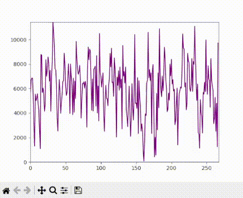

# Basic Audio Visualizer

This project demonstrates a simple audio visualizer using Python. It analyzes the volume (RMS) of an audio file and creates a waveform visualization over time.

## Features

- **Volume Analysis**: Visualizes the volume (RMS) of an audio file.
- **Waveform Plot**: Displays a simple waveform plot that shows how the audio volume changes over time.

## Requirements

- Python 3.x
- `pydub` library
- `matplotlib` library
- `numpy` library
- `ffmpeg`

## Installation

1. **Clone the Repository**:
   ```bash
   git clone https://github.com/your-username/basic-audio-visualizer.git
   cd basic-audio-visualizer
   ```

2. **Install Dependencies**:
   Install the required Python libraries using pip:
   ```bash
   pip install pydub matplotlib numpy
   ```

3. **Install FFmpeg**:
   There are two common ways to install `FFmpeg`:

   **Option 1: Install via Winget (Recommended for Windows Users)**
   ```bash
   winget install ffmpeg
   ```
   After installation, **restart your command prompt or VS Code** to ensure that the `ffmpeg` path is recognized.

   **Option 2: Install via Pip**
   ```bash
   pip install ffmpeg-python
   ```
   Note: This method installs the `ffmpeg-python` wrapper. You may still need the full `FFmpeg` executable, so installing via `winget` or downloading it directly is recommended.

4. **Verify FFmpeg Installation**:
   Run the following command to check if `ffmpeg` is properly installed:
   ```bash
   ffmpeg -version
   ```
   If you see version information, `ffmpeg` is correctly installed.

5. **Restart Requirement**:
   If you encounter any issues with `ffmpeg` not being recognized, try restarting VS Code or your terminal session.

## Usage

1. **Place Your Audio File**:
   - Place your audio file (e.g., `your_song.mp3`) in the project directory.

2. **Run the Visualizer**:
   - Replace `"your_song.mp3"` in the script with your audio file's name.
   - Execute the script:
     ```bash
     python visualizer.py

3. **View the Waveform**:
   - A window will open displaying the waveform plot, showing how the volume changes over time.
     ```
## Animating the Waveform

This project now includes an animated waveform feature. The visualization dynamically updates to show the waveform scrolling over time.

## Example Output

Here’s an example of what the waveform plot might look like:



## Next Steps

- Experiment with different chunk sizes to see how it affects the visualization.
- Try visualizing other audio properties, like frequency or pitch.

## Contributing

Feel free to fork the project and submit pull requests if you have improvements or additional features to suggest.

## License

This project is licensed under the MIT License - see the [LICENSE](LICENSE) file for details.
